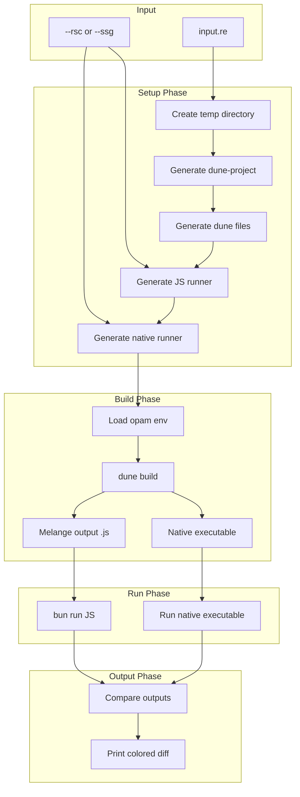

# React vs server-reason-react Comparison Tool

## Overview

Create a comparison tool at `compare/compare.sh` that takes a `.re` file, builds both JS (via melange) and native versions, runs them, and compares the output. This addresses issue #304.

## Architecture



## Directory Structure

```
compare/
├── compare.sh           # Main script
├── templates/
│   ├── dune-project.template
│   ├── dune-melange.template
│   ├── dune-native.template
│   ├── rsc-runner.js.template
│   ├── ssg-runner.js.template
│   ├── rsc-runner.ml.template
│   └── ssg-runner.ml.template
└── examples/
    ├── simple.re        # Simple test case
    └── suspense.re      # Suspense test case
```

## Key Files

### 1. `compare/compare.sh`

Main script that:

- Parses args: `./compare.sh [--rsc|--ssg] input.re`
- Creates temp directory
- Copies input.re and generates dune files from templates
- Runs `dune build` for both melange and native targets
- Executes JS via `bun` and native directly
- Compares outputs and prints with ANSI colors

### 2. Templates

#### `dune-project.template`

Minimal dune-project with melange enabled, pinned to workspace packages.

#### `dune-melange.template`

Melange library + emit config:

```dune
(library
 (name input_js)
 (modes melange)
 (libraries reason-react)
 (preprocess (pps reason-react-ppx melange.ppx)))

(melange.emit
 (target output)
 (module_systems (es6 mjs))
 (libraries input_js))
```

#### `dune-native.template`

Native executable:

```dune
(executable
 (name runner)
 (libraries react reactDOM lwt lwt.unix)
 (preprocess (pps server-reason-react.ppx lwt_ppx)))
```

#### JS Runner Templates

Based on `arch/server/render-rsc-to-stream.js` for RSC and `arch/server/render-html-to-stream.js` for SSG. Will import the generated melange module and pipe output to stdout.

#### Native Runner Templates

Will use `ReactServerDOM.render_model` for RSC and `ReactServerDOM.render_html` for SSG, outputting to stdout similar to test patterns in `packages/reactDom/test/test_RSC_model.ml`.

## Output Format

```
┌─────────────────────────────────────────┐
│ Comparing: simple.re (RSC mode)         │
├─────────────────────────────────────────┤
│ React.js output:                        │
│ 0:["$","div",null,{"children":"hi"}...] │
├─────────────────────────────────────────┤
│ server-reason-react output:             │
│ 0:["$","div",null,{"children":"hi"}...] │
├─────────────────────────────────────────┤
│ ✓ Outputs match                         │
└─────────────────────────────────────────┘
```

Or on mismatch, show a diff with colors (red/green).

## Constraints

- The input.re must export a component named `App` (convention)
- Script requires: `opam`, `dune`, `bun`, `diff`
- Temp files cleaned up on exit (trap)
- Exit code 0 if match, 1 if mismatch
